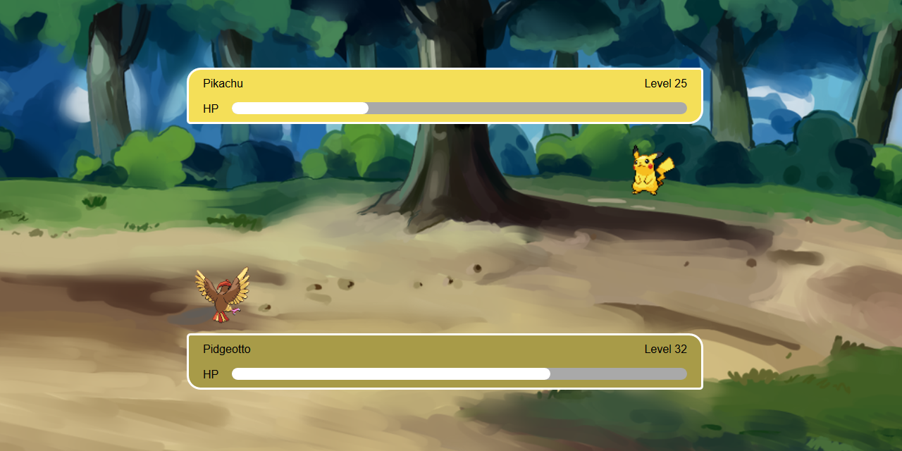
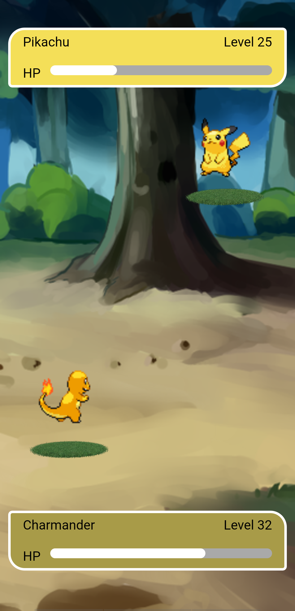

# Pokemon Battle Scene

This folder consists of index.html and static folder

index.html:
    This file is used to display battle scene between two pokemons

Static folder consists of CSS and Images folders

CSS Folder consists of app.css

app.css:
    This is used for styling the index.html
    Pokemon animations are used by keyframes

Images folder consists of two pokemon images and background image

[Click this Link to Open](https://venkatpantham.github.io/edyst-s19-pokemon-battle-scene/frontend/index.html)

Desktop Screenshot

Mobile Screenshot

